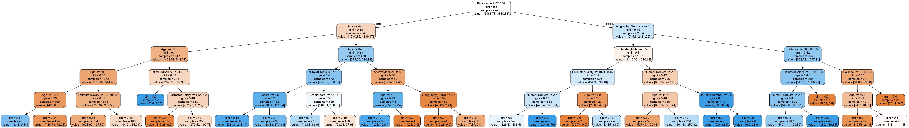

# Predicting customer churn

This is a project on predicting customer churn from a banking customer dataset on Kaggle.

Results with logistic regression \n

Decision tree example from random forest \n

